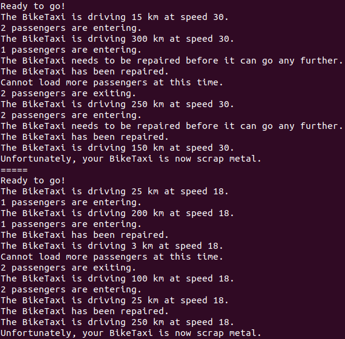

# 02.10 - 01. Python OOP Concepts - Transport vehicles

In this exercise we will check how inheritance in Python and the usage of the **_super()_** built-in method and **_self_** work in connection with multiple inheritance.

## The problem

You are working for the Berlin city traffic planning office. The system the office is using has been used for many years and it used to monitor all kinds of transport related things. The system classifies all types of vehicles present in the city by means of a large number of classes and subclasses. The class for each vehicle is ultimately derived from the super class _**Vehicle**_. Each subclass is adding methods and variables that are relevant just for that type of vehicle.

This has worked for a long time, but yesterday the mayor announced that the city will be rolling out a new type of public transportation: bicycle taxis. These need to be classified both under "public transport vehicles" and under "bikes" which hitherto had been two separate and incompatible categories in the system. Bikes had been assumed to always be without a motor and public transport vehicles had been assumed to always have a motor.

You are being called in as an expert to make a change to the system that should affect the system as little as possible but still manages to add bike taxis, both with and without motors, to the system. You only get to work on those classes that are relevant for your work, but you know that there are many more sub classes (for cars, ships, airplanes, buses, the metro, etc.) that all rely on the rest of the system to continue to work as it does.

### Overview of vehicle.py:
- The **_Vehicle_** class represents any kind of transport vehicle.
- It has attributes specifying the _**speed**_, the _**maximum_mileage**_ and whether or not it is _**motorized**_.
- It has a protected attribute _**__scrap_metal**_ that keeps track of whether the vehicle can still drive or whether it is scrap metal.   
- It prints `"Ready to go!"` after being initialized and this message should only be printed once for each vehicle.
- It has a method _**drive(km: int) -> bool**_. This method checks whether the vehicle is not yet scrap metal and if that is not the case, it prints how many kilometers the vehicle is driving. It subtracts the number of km from the _**maximum_mileage**_. If the _**maximum_mileage**_ ends up under 0, it sets the  _**__scrap_metal**_ attribute to **True**. It will return **True** if the vehicle is able to drive the requested amount and otherwise **False**.
- No extra action should be taken here.

### Overview of public_transport.py
- The _**PublicTransport**_ class subclasses **Vehicle**. Public transport is normally motorized, so it calls the **Vehicle** constructor setting _**motorized**_ to **True** it forwards all other values. It adds a protected attribute _**__current_passengers**_ and adds public methods **_enter_passengers(num: int)_**, **_exit_passengers(num: int)_** and **_get_current_passengers() -> int_** to obtain the current number of passengers.
- Modify the constructor method of _**PublicTransport**_ so that it only specifies _**motorized**_ if it has not yet been specified.

### Overview of bike.py
- The _**Bike**_ class subclasses **Vehicle**. Bikes are normally not motorized, so it calls the **Vehicle** constructor setting _**motorized**_ to **False** and _**speed**_ to 20. It adds a private attribute _**_mileage_until_next_repair**_ that is initiated at 200. It adds a method called _**repair()**_ that resets the _**_mileage_until_next_repair**_ to 200. It's _**maximum_mileage**_ is 600.
- It overrides the _**drive(km: int)**_ method, checking whether _**_mileage_until_next_repair**_ is above 0, and if this is the case, it subtracting the **km** from the _**_mileage_until_next_repair**_ and calls the _**drive(km: int)**_ method of the parent class.
- Modify the constructor method of _**Bike**_ so that it only sets the _**speed**_ if no speed has been specified yet and only specifies _**motorized**_ if it has not yet been specified.

### Overview of bike_taxi.py
- You need to modify the _**BikeTaxi**_ class so that it subclasses both **PublicTransport** and **Bike**. It should be created to so that it has all the methods and attributes of both parent classes. Bike taxis exist both with and without a motor, so the constructor method needs to accept an argument specifying whether or not it is motorized by initiating it as **BikeTaxi(motorized: bool)**.
- A motorized bike taxi can carry 4 passengers and a non-motorized bike taxi can carry 2 passengers.
- A motorized bike has a speed of 30 and a non-motorized bike taxi has a speed of 18.
- It should override the **_enter_passengers(num: int)_** method, checking that there are never more than the allowed number of passengers onboard at a time and printing the error `"Cannot load more passengers at this time."` if there are too many. If the number of passengers is acceptable, it should call the **_enter_passengers(num: int)_** method of the **PublicTransport** class.

### Overview of app.py:
- This is where the main method resides, therefore this is where your code should be executed. A motorized and a non-motorized bike taxi are initiated. Both bike taxis are then driven around town until they turn into scrap metal.

You should have an output similar to the one below:

