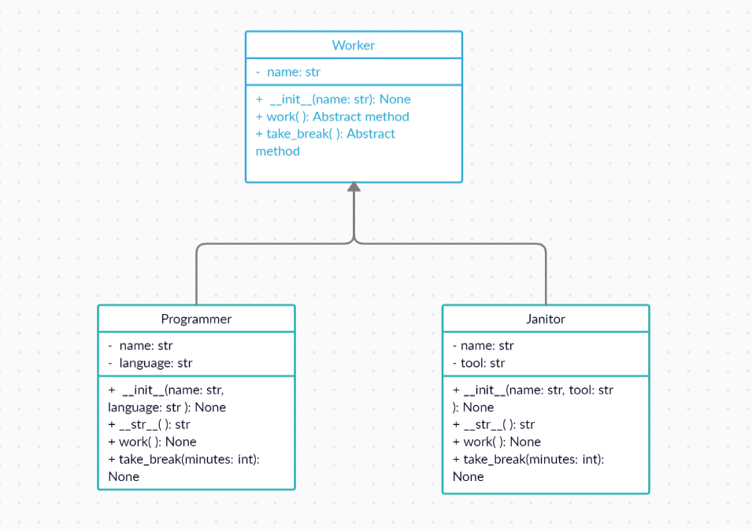

# Task 1
### Abstract Method implementation

In the file **src/tool.py** : We defined an abstract class **Tool**, with one abstract method **work**:
```python
class Tool:
    def work(self):
        raise NotImplementedError("Abstract Method not implemented")
```

- [x] In the subclass **Laptop**; Implement code so that you don't get the **NotImplementedError** exception:
```python
# Write your code here to implement the Laptop class correctly
class Laptop(Tool):
    def work(self):
        print("Laptop is running")
```
> **Solution:**
> 
> Laptop inherits from Tool
> 
> The method work() is implemented (overridden) in Laptop

To test your code, run the command:
```
python src/check_1.py
```

# Task 2
### abc module
Consider the following class diagram:


The class **Worker** is the abstract mother class and its subclasses are **Programmer** and **Janitor**. 

Complete the code in the file **src/worker.py** so that: 
- [x] The class **Worker** is an abstract class i.e., it inherits from the *Abstract Base Class* **ABC**.
- [x] The methods **work()** and **take_break()** are abstract. *What should you add?*

```python
class Worker(ABC):
    def __init__(self, name):
        self.name = name

    @abstractmethod
    def work(self):
        print(f"\n\n{self.name} starts working:")

    @abstractmethod
    def take_break(self, minutes):
        print(f"\n\n{self.name} takes {minutes} minutes break:")
```
> **Solution:**
> 
> The class **Worker** inherits from the class **ABC**.
> 
> The methods **work()** and **take_break()** are decorated with **@abstractmethod**
---
The class **Programmer** is a subclass of **Worker**:
- [x] Complete the class **Programmer** and implement its methods properly. Feel free to use your own print statements e.g. `print("The programmer is coding")`
```python
class Programmer(Worker):
    def __init__(self, name, language):
        super().__init__(name)
        self.language = language

    def __str__(self):
        return f"{self.name} codes with {self.language}"

    def work(self):
        super().work()
        print(f"The programmer is coding with {self.language}")

    def take_break(self, minutes):
        super().take_break(minutes)
        print("Programmer plays ninja fruit")
```

> **Solution:**
> 
> Make sure that **Programmer** is a subclass of **Worker**.
> 
> Make sure that the abstract methods **work()** and **take_break()** are implemented in the class **Programmer**. The code in the abstract methods in the mother class can be reused thanks to *super.work()* and *super.take_break()* 


---
In the file **src/worker.py**, the class **Janitor** should be a subclass of **Worker**
```python
class Janitor(Worker):
    def __init__(self, name, tool):
        super().__init__(name)
        self.tool = tool

    def __str__(self):
        return f"{self.name} uses {self.tool}"

    def work(self):
        super().work()
        print(f"The janitor is working with {self.tool}")

    def take_break(self, minutes):
        super().take_break(minutes)
        print(f"Janitor {self.name} listens to music")
```
- [x] Complete the code above to implement the class Janitor and all its methods: \__init__(), \__str__(), work(), take_break().

####+ __init__(str, str): None
Instantiate object **Janitor** with arguments **name** and **tool**.

####+ __str__(): str
Return a string representation of the object.

####+ work(): None
Override the abstract method **work()** and add a print statement similar to `print(f"Janitor is working with {tool}")`

####+ take_break(int): str
Override the abstract method **take_break()** and add a print statement similar to `print(f"Janitor is listening to music for {minutes} minutes")`

> **Solution:**
> 
> Make sure that **Janitor** is a subclass of **Worker**.
> 
> The same approach as we did with the class **Programmer**


To test your code, run the command:
```
python src/check_2.py
```

