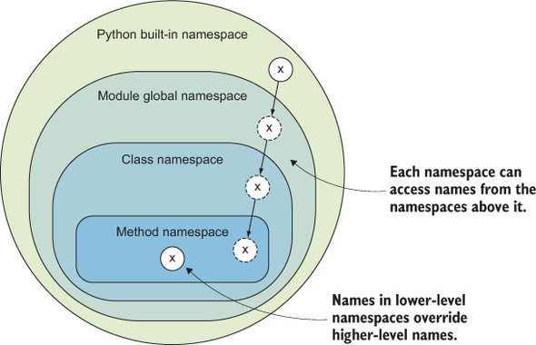

# Python - Libraries & Tools:03 - Scope & Modules

> Learning Goals
>- LEGB Rule
>- Modules
>- Namespaces & Symbols
>- Libraries

**LAST SESSION**

- monkey patching:
    - change behavior in runtime

1. Testing
2. Workarounds in third party libraries

```python
import my_module

my_module.some_fun = lambda x: return x**2
```

- cli:
    - argparse
    - getopt
- two  type of options:
    1. long (--)
    2. short(-)
- we can have option that require a value and option that don't require any value
- positional args don't require an option


**sys.stdout.write**

- **Purpose:** It's a method from the `sys` module that allows you to write strings to the standard output stream, which is typically the console/terminal window.
- **Functionality:** When you call `sys.stdout.write(data)`, it sends the provided `data` (a string) to the standard output.
- **Key Points:**
    - Unlike `print`, it does **not** automatically add a newline character (`\n`) at the end. 
    - You'll need to include it manually if you want a new line after the output.
    - It's generally less convenient for everyday printing compared to `print` as it lacks the newline and formatting features.

```python
import sys
sys.stdout.write('data\n')
sys.stdout.write('data')
```


**Relationship with print**

- **Underlying Mechanism:** The `print` function in Python actually leverages `sys.stdout.write` internally.
- It writes the arguments passed to `print` to the standard output stream using `sys.stdout.write` and then adds a newline character (`\n`).

```python
print('Hello', end='\n') #default
print('World')
```

**example monkey patch the print function**

```python
import sys

my_original_write = sys.stdout.write
count = 0
def count_print(text):
    global count
    count += 1
    my_original_write(text)
    my_original_write(f'{count}\n')
    
sys.stdout.write = count_print
print('a', 'b', sep='c', end='BLA')

def print_HELLO(text):
    if not text=='\n':
        my_original_write('HELLO')

# sys.stdout.write = print_HELLO  #monkey patching

```

```python
import sys

my_original_write = sys.stdout.write

def reverse_write(text):
    reverse_string = text[::-1]
    my_original_write(reverse_string)

sys.stdout.write = reverse_write

print('Hello') # olleH
print('BLa')

sys.stdout.write = my_original_write

print('Hello') # olleH
print('BLa')

```

**Example: Context Manager with reversed print**

```python
import sys

class LookingGlass:
    def __enter__(self):
        self.original_write = sys.stdout.write
        sys.stdout.write = self.reverse_write # 3.

    def reverse_write(self, text):
        reverse_string = text[::-1]
        self.original_write(reverse_string)

    def __exit__(self, exc_type, exc_msg, traceback):
        sys.stdout.write = self.original_write #6.

with LookingGlass():
    print('Hello World')
    print('Greetings')

print('Back to normal')
```

1. Python invokes __enter__ with no arguments besides self.
2. Hold the original sys.stdout.write method, so we can restore it
later.
3. (**Monkey-patch**) sys.stdout.write is overwritten it with our own
method.
4. Our replacement to sys.stdout.write reverses the text argument
and calls the original implementation.
5. Python calls __exit__ with None, None, None if all went well;
6. Restore the original method to sys.stdout.write.

## Quiz

**Monkey Patch builtins**
```python
import builtins

print(dir(builtins))

def change_input(text):
    return 10

builtins.input = change_input

assert input('hello world') == 10
```

**logging with monkey patch**

```python
def my_sum(a, b):
    return a + b

original_func = my_sum

def logging(*args):
    print('functions my_sum called with', *args)    
    return original_func(*args)

my_sum = logging

print(my_sum(1, 2))
```

## Lesson

### Modules

- code for reuse stored in a python file
- The Python module is the highest-level program organization unit,
- which packages program code and data for reuse, 
- and provides self-contained namespaces that minimize variable name clashes across your programs.
- Each file is a module, and modules import other modules to use the names/symbols/variables they define.
- Modules provide an easy way to organize components into a system by serving as self-contained packages of variables know as namespaces.
- Python's modules allow us to link individual files into a larger program system.

## Symbol table

- A symbol table in the context of Python is a data structure used by the Python interpreter 
- it stores information about the scope and binding of variables during the execution of a program. 
- It serves as a reference for variable names (symbols) and their associated information, such as 
    1. scope
    2. type, and 
    3. value

- Each scope has its own symbol table.
    1. Global Symbol Table
    2. Local Symbol Table
    3. Built-in Symbol Table

- The python `globals` function is a built-in function that is used to modify and return a dictionary and its values of the current **global symbol table**
- A dictionary returned by the `locals()` function stores the values of the current **local symbol table**

```python
x = 10

print(globals())

def my_func():
    global x
    x = 20

    # globals()['x'] = 30 # changes the value of x directly in the global symbol table and effects
    # the global value of x
    print(locals())

print(x) # 10
my_func()
print(x) # 20
``` 

## Namespaces in Python

A namespace is a collection of currently defined symbolic names along with information about the object that each name references. 

- Namespace: A container where names are mapped to objects. 
- Symbol tables are used to implement namespaces.

In a Python program, there are four types of namespaces:
- Built-In
- Global
- Enclosing
- Local

### LEGB Rule

- Defines the namespace resolution order of the Python interpreter.
- The interpreter searches for a name from the inside out, looking in the local, enclosing, global, and finally the built-in scope
If the interpreter doesn’t find the name in any of these locations, then Python raises a NameError exception.


**Non local scope / enclosing scope:**


**Local Namespace**

- The Python interpreter creates a new namespace whenever a function executes. 
- That namespace is local to the function and remains in existence until the function terminates.

**Enclosing Namespaces**
- Functions don’t exist independently from one another only at the level of the main program.
- You can also define one function inside another


```python
def outer():
    x = 1 # enclosing scope from the perspective of inner
    # but local scope from the perspective o f outer
    def inner():
        nonlocal x
        x = x + 1
        print(x)
    return inner

my_inner = outer()
my_inner()
my_inner()
```

**Global Namespace**

- The global namespace contains any names defined at the level of the main program. 
- Python creates the global namespace when the main program body starts, and it remains in existence until the interpreter terminates.

#### Built-in Namespace

- The built-in namespace contains the names of all of Python’s built-in objects.
- These are available at all times when Python is running. 
- You can list the objects in the built-in namespace with the following command:

```python
print(dir(__builtins__))
```

- You’ll see some objects here that you may recognize from previous lectures, for example, built-in functions like max() and len(), and object types like int and str.
- The Python interpreter creates the built-in namespace when it starts up. 
- This namespace remains in existence until the interpreter terminates.

```python
import builtins

def my_sum(a,b):
    global sum
    sum = a + b
    return sum

print(my_sum(1,2))

print(builtins.sum([1,2,3])) 
#print(sum([1,2,3])) # TypeError: 'int' object is not callable; 3()
```



# Import statements

- Module contents are made available to the caller with the import statement. 
- The caller of a module is the unit of program code in which the call to the module occurred.

The simplest form of importing module:

```
import <module_name>
```

- a module creates a separate namespace.
- *import module* does not make the module contents directly accessible to the caller

##	Import Objects from Module

```python
import math

pi = 3.00
print(math.pi) # accessed the local context of the module via dot notation
```

- Every name that is assigned a value at the top level of a module file becomes an attribute of that module.

##	Import Individual Objects

```Python
from <module_name> import <name(s)>
```
An alternate form of the import statement allows individual objects from the module to be imported


```python
from math import pi

print(pi) 
```

#### Import with Alternate Name

```python
from math import pi as PI

print(PI) 
```

#### Import all objects from a Module

```python
from math import * # bad practice

print(list(globals().keys())) 
print(e)
```

##	Import Module with Alternate Name

```python
import math as mathematics

print(mathematics.pi)
```

### Introduction to `pip`

- `pip` makes it easy to install, upgrade, 
and remove Python packages from the Python Package Index (PyPI) and other package repositories.
- It stands for "Pip Installs Packages" or "Pip Installs Python."

#### Key Features

- Package Management
- Dependency Resolution
- Ease of Use
- Virtual Environment Support

#### Basic Commands

1. **Installing Packages:**

    ```bash
    pip install package_name
    ```

2. **Upgrading Packages:**

       ```bash
   pip install --upgrade package_name
   ```

   - Upgrades the specified package to the latest version.

3. **Uninstalling Packages:**
   ```bash
   pip uninstall package_name
   ```
   - Uninstalls the specified package.

4. **Listing Installed Packages:**
   ```bash
   pip list
   ```
   - Lists all installed packages in the current environment.

5. **Checking Package Information:**
   ```bash
   pip show package_name
   ```
   - Displays detailed information about a specified package.


6. **Freezing Package Versions:**
  ```bash
   pip freeze > requirements.txt
   ```
   - Outputs installed packages and their versions to a `requirements.txt` file.

7. **Installing from Requirements File:**
   ```bash
   pip install -r requirements.txt
   ```

- Installs all the packages listed in a `requirements.txt` file.


### Introduction to Python Virtual Environments (venv)

- they create isolated Python environments for different projects.
- A virtual environment in Python is a self-contained directory 
        - that contains a Python installation for a particular version of Python
- Virtual environments are crucial for managing dependencies

**installing venv**

> sudo apt install python3.8-venv 

1. **Creating a Virtual Environment:**
    - To create a virtual environment, you use the `venv` module, which is included in the standard library.
    ```bash
   python3.8 -m venv myenv
   ```
   - This command creates a directory named `myenv` containing the virtual environment.

2. **Activating a Virtual Environment:**
   - Once the virtual environment is created, you need to activate it.
     - **On Windows:**
     ```bash
     myenv\Scripts\activate
     ```
    - **On macOS and Linux:**
     ```bash
     source myenv/bin/activate
     ```
    - After activation, your command prompt will change to indicate that the virtual environment is active.

3. **Deactivating a Virtual Environment:**
   - To deactivate the virtual environment and return to the global Python environment:
   ```bash
   deactivate
   ```